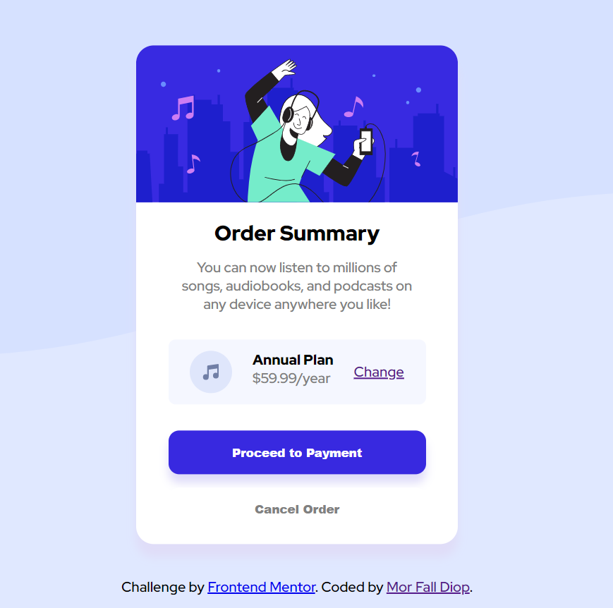

# Frontend Mentor - Order summary card solution

This is a solution to the [Order summary card challenge on Frontend Mentor](https://www.frontendmentor.io/challenges/order-summary-component-QlPmajDUj). Frontend Mentor challenges help you improve your coding skills by building realistic projects. 

## Table of contents

- [Overview](#overview)
  - [The challenge](#the-challenge)
  - [Screenshot](#screenshot)
  - [Links](#links)
- [My process](#my-process)
  - [Built with](#built-with)
  - [What I learned](#what-i-learned)
  - [Continued development](#continued-development)
  - [Useful resources](#useful-resources)
- [Author](#author)

## Overview

### The challenge

Users should be able to:

- See hover states for interactive elements

### Screenshot

### Links

- Solution URL: [Add solution URL here](https://www.frontendmentor.io/challenges/order-summary-component-QlPmajDUj/hub/order-summary-component-with-mobilefirst-workflow-sass-and-flexbox-2hYLczEXI)
- Live Site URL: [Github Pages](https://diopmorfall.github.io/order-summary-component/)

## My process

### Built with

- Semantic HTML5 markup
- SASS
- CSS custom properties
- Flexbox
- Mobile-first workflow

### What I learned

- Mobile-first approach: I've always been using the desktop-first approach, but after I learned that scaling down the features to the mobile layout was not optimized, I decided to give a shot to the mobile-first workflow which I found is easier and faster than the old approach

- Flexbox: after studying it, I decided to integrate it in the project, and I'm really glad I did because it made everything easier

- Sass: this is also the first project where I decided to use Sass instead of plain CSS, and like the two other concepts I learned I found it very useful

### Continued development

I think the project is at a good point, but there's always room for improvement: for example, the button and container shadows are not like in the project, and I need to find out the right amount of shade and color.
Also it'll surely be useful in future, for example I could embed this or take inspiration from it when I'll build an application that might need this component.

### Useful resources

- [Interneting is hard](https://internetingishard.netlify.app/html-and-css/) - This is a basic tutorial that helped me learning HTML and CSS; the practical examples which I really like, affected my understanding of the topics ina great way.
- [W3Schools.com](https://www.w3schools.com/) - This is an amazing website which helped me test my knowledge with some exercises, and looking for how to implement some features.

## Author

- Frontend Mentor - [@diopmorfall](https://www.frontendmentor.io/profile/diopmorfall)
- LinkedIn - [Mor Fall Diop](https://www.linkedin.com/in/mor-fall-diop-07b40a18b)

